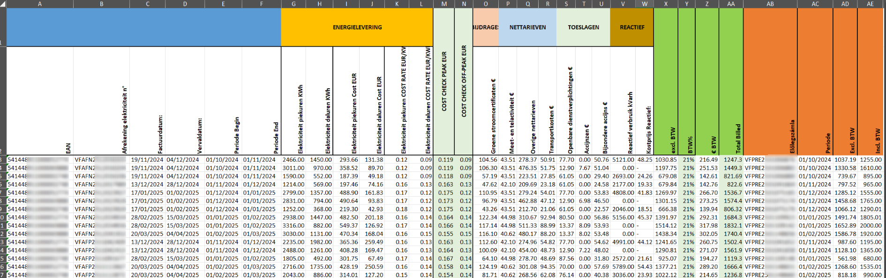

# PAD Extractor Automation for Supplier Elindus

> **Specialized automated extraction from three different invoice types of Elindus (elindus.be), a Belgian energy supplier, using Power Automate Desktop.**

---

## 🚀 Project Overview

This project automates the extraction of structured data from two invoice types issued by **Elindus**:

- **Prepayment Invoices** (advance billing)
- **Regular Invoices** (consumption-based billing)

Two customized **Power Automate Desktop (PAD)** workflows were developed to process each invoice type independently.  
The automations generate structured Excel outputs for further analysis.

---

## 📂 Project Structure

| Folder | Content |
|--------|---------|
| `/assets/screenshots/prepayment_flow/` | Screenshots & GIFs related to prepayment invoice automation |
| `/assets/screenshots/regular_flow/` | Screenshots & GIFs related to regular invoice automation |
| `/assets/outputs/prepayment_output/` | Sample Excel outputs for prepayment invoices |
| `/assets/outputs/regular_output/` | Sample Excel outputs for regular invoices |

---

## 🛠️ Technologies Used

- **Power Automate Desktop** (Microsoft)
- **Excel** (.xlsx format)
- **PDF Parsing** via PAD native actions
- **ScreenToGif** for animated process demos

---

## 🧩 Key Features

- **Separate automation flows** per invoice type
- **Excel mapping preparation** prior to extraction
- **Error handling and batch processing**
- **Adaptation to Elindus-specific invoice formats**
- **Structured Excel outputs optimized for reporting**

---

## 📽️ End-to-End Process Demonstrations

### 1. Regular Invoice Processing

#### 📝 Excel Input Preparation (Regular Invoice)

#### ⚙️ PAD Automation Flow (Regular Invoice)

---

### 2. Prepayment Invoice Processing

#### 📝 Excel Input Preparation (Prepayment Invoice)

#### ⚙️ PAD Automation Flow (Prepayment Invoice)

---

## 🖼️ Example Invoices and Outputs

### 📄 Sample Invoices (PDF screenshots)

#### Prepayment Invoice Example (Elindus)

#### Regular Invoice Example (Elindus)

---

### 📈 Sample Excel Outputs

#### Prepayment Invoice Output (Excel)

#### Regular Invoice Output (Excel)

---

## 🎯 Why This Automation Matters

Manual invoice processing:
- Is **time-consuming**  
- Leads to **data entry errors**  
- Delays **financial reporting**

By tailoring the automation to **Elindus' invoice templates**, this solution:
- Reduces manual input time by up to **80%**
- Improves **data accuracy**
- Provides **ready-to-analyze Excel outputs**

---

## 📥 How it Works

1. Opens **Power Automate Desktop**.
2. Imports the **Prepayment Flow** or **Regular Flow** based on the invoice type.
3. Checks the input folder containing the PDFs.
4. Runs the automation.
5. Extracts the data
6. Enters the extracted output into Excel automatically.

---

